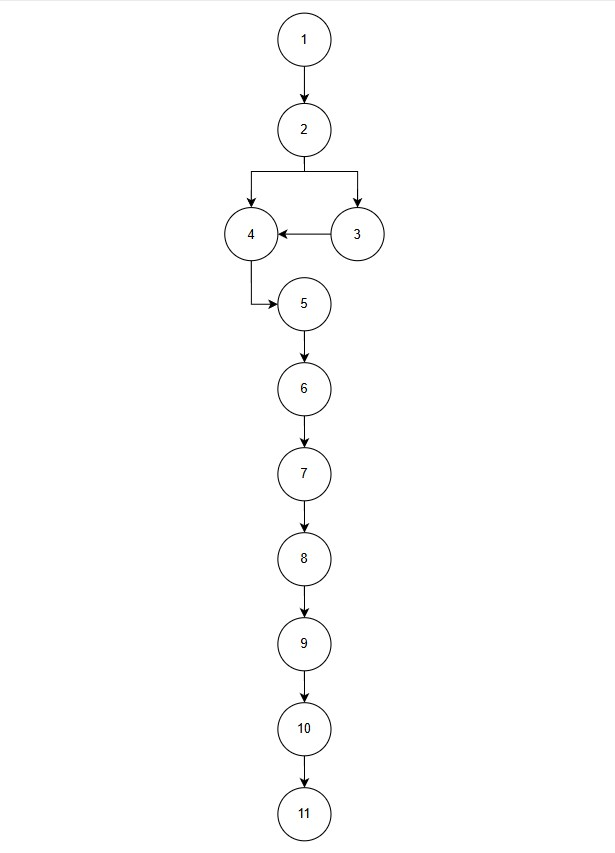

# Projeto Karatsuba
## Sobre o Projeto
O algoritmo de Karatsuba é uma técnica eficiente para multiplicação de números
inteiros grandes, introduzida por Anatolii Karatsuba em 1960. Ele melhora a
complexidade da multiplicação em comparação ao método tradicional de
multiplicação direta. Este projeto utiliza a biblioteca padrão do Python, garantindo que seja simples de rodar e entender, mesmo em ambientes isolados.

## Explicação do Algoritmo
Um algoritmo usual de multiplicação resolve um cálculo em tempo proporcional a *n²*, sendo *n* o número máximo de algarismos naturais do maior fator. O algoritmo de Karatsuba reduz uma grande multiplicação para 3 pequenas, tornando o cálculo mais eficiente.

**Considerando**:
- *num1* e *num2* = números com no máximo *n* dígitos
- *esq1* = n/2 primeiros dígitos (dígitos mais significativos) de *num1*
- *dir1* = n/2 últimos dígitos (dígitos menos significativos) de *num1*
- *esq2* = n/2 primeiros dígitos (dígitos mais significativos) de *num2*
- *dir2* = n/2 últimos dígitos (dígitos menos significativos) de *num2*

**Então**:

    num1 = esq1 * 10^n/2 + dir1 
    // o mesmo processo se repete para num2
exemplo: `1234 = 12 * 10^2 + 34 = 1200+34 = 1234`

**Descrição do cálculo**:

    num1 * num2 = (esq1 * 10^n/2 + dir1)*(esq2 * 10^n/2 + dir2)
    num1 * num2 = esq1 * esq2 * 10^n + esq1 * dir2 * 10^n/2 + dir1 * esq2 * 10^n/2 + dir1 * dir2
    num1 * num2 = esq1 * esq2 * 10^n + (esq1 * dir2 + dir1 * esq2) * 10^n/2 + dir1 * dir2

A última linha possui 4 multiplicações relevantes porque a multiplicação pro 10^n representa um deslocamento (=*shift*) do vetor para a esquerda, o que é mais barato que uma multiplicação pois consome n unidades de tempo. Assim sendo, A expressão reduz a multiplicação de dois números com no máximo n dígitos para quatro multiplicações de números com no máximo n/2 dígitos cada.

**Reduzindo**:
Adicionando a variável: `y = (esq1 + dir1) * (esq2 + dir2)`
Podemos reescrever a fórmula da seguinte maneira:

    num1 * num2 = dir1 * dir2 * 10^2m + (y - esq1 * esq2 - dir1 * dir2) * 10^m + dir1 * dir2

Essa alteração reduz uma multiplicação, resultando em um total de 3.

## Lógica do algoritmo implementado
#### Linha 1
O algoritmo inicia com a função `karatsuba()` recebendo dois números (*num1* e *num2*)
#### Linhas 2 e 3 (base da recursão)
Nesse bloco é feito uma validação se o número possui menos de 2 dígitos, para indicar a base da recursão. Em caso positivo, os dois números recebidos são multiplicados e o resultado é retornado.
#### Linhas 5 e 6 (contagem de algarismos)
A linha 5 utiliza a função `max()` para atribuir à ***n***  a quantidade de algarismos naturais que o maior número recebido possui. Para isso, os valores recebidos são transformados em *string* e o tamanho de cada um é contado, por meio  das funções `len()` e `str()` aninhadas.

Logo em seguida, é atribuído à ***m*** a metade do resultado de ***n*** para iniciar a organização da divisão do número para a recursividade.
#### Linhas 8 e 9 (organização das variáveis)
Nessa parte é feita a organização das variáveis que serão utilizadas no algoritmo. Para dividir os números em duas partes, obtendo a divisão inteira e o resto da divisão, foi utilizada a função `divmod()`, que atribui respectivamente os valores mencionados em 2 variáveis. No algoritmo apresentado são elas:

- variável ***num1***
    - *esq1* para a parte inteira do primeiro número
    - *dir1* para o resto da divisão do primeiro número
- variável ***num2***
    - *esq2* para a parte inteira do segundo número
    - *dir2* para o resto da divisão do segundo número

#### Linhas 12, 13 e 14 (divisão)
Essas linhas iniciam a parte da divisão do algoritmo, implementando 3 recursividades:

- ***rec1*** chama novamente o método para as variáveis da parte inteira (*esq1*, *esq2*)
- ***rec2*** chama novamente o método para as variáveis do resto da divisão (*dir1*, *dir2*)
- ***rec3*** chama novamente o método para as somas das duas variáveis relacionadas ao mesmo número (*esq1* somado a *dir1*, *esq2* somado a *dir2*)

#### Linha 17 (conquista)
Por fim, é feita a conquista com a combinação das 3 recursões por meio da seguinte função:

    (rec1 * 10**(2*m)) + ((rec3 - rec1 - rec2) * 10**m) + rec2

## Como executar o projeto
### Passo 1: Criar e ativar o ambiente virtual
É recomendável usar um ambiente virtual para gerenciar suas dependências. Siga os passos abaixo para configurar um ambiente virtual:

1.  Crie um ambiente virtual usando o seguinte comando:
    `python3 -m venv .venv`

2.  Ative o ambiente virtual:
    -   No macOS e Linux: `source .venv/bin/activate`
    -   No Windows: `.venv\Scripts\activate`

### Passo 2: Executar o script
Após ativar o ambiente virtual, execute o script principal: `python main.py`

### Versão do Python
Este projeto foi desenvolvido na versão  **3.13.2**  do Python e  **não exige a instalação de nenhuma dependência adicional**.

## Relatório técnico
### Análise da complexidade ciclomática
#### Fluxo de Controle da função
1. verificação se um dos números é <10
2. se 1 for verdadeiro: retorna o resultado da multiplicação
3. se 1 for falso: variável n recebe o número que representa a maior quantidade de algarismos dentro dos valores recebidos na função
4. variável m recebe a metáde da variável n
5. as variáveis esq1 e dir1 recebem os valores da divisão e do resto de num1 por 10^n/2
6. as variáveis esq2 e dir2 recebem os valores da divisão e do resto de num2 por 10^n/2
7. a variável rec1 recebe o resultado de esq1 * esq2
8. a variável rec2 recebe o resultado de dir1 * dir2
9. a variável rec3 recebe o resultado da multiplicação das somas (dir1+esq1) e (dir2+esq2)
10. retorno da função de combinação dos resultados

#### Grafo de fluxo de controle

#### Cálculo da complexidade ciclomática

    M = E - N + 2P
    M = 9 - 10 + 2(1)
    m = 2

### Análise da complexidade assintótica
- complexidade temporal
  O algoritmo de Karatsuba divide a multiplicação em três chamadas recursivas, reduzindo o tamanho dos números pela metade a cada etapa. Podemos expressar a complexidade temporal pela seguinte recorrência: `T(n)=3T(n/2)+O(n)`

- complexidade espacial
  Como cada chamada divide o problema pela metade, a recursão tem profundidade `O(logn)`